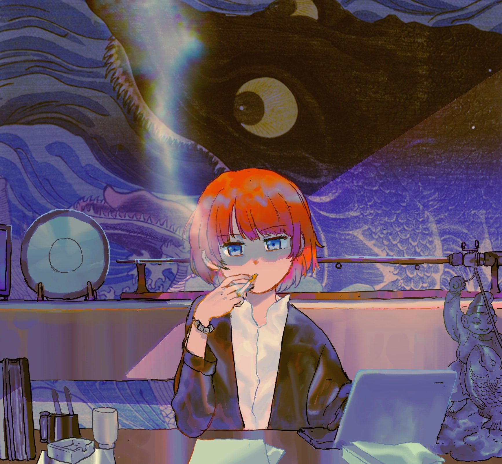
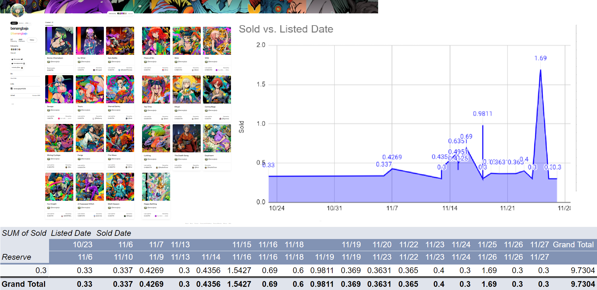
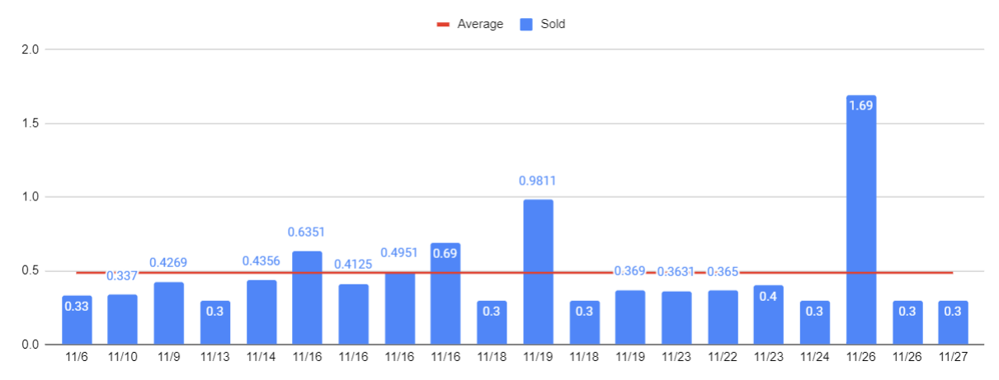

> 原文：[thoughts as a collector (november 2021)](https://rwx.mirror.xyz/oZAVzydqTHSn-2K3-MxwoWjizt4ZRc1WEV3KoX5dozE)

# コレクターとして思うこと（2021年11月）

[@jungnft](https://twitter.com/jungnft) さんが描いた私

こんにちは、あなたは私を知っているかもしれませんし、知らないかもしれません。私の名前はrobekで、アーティストでありNFTのコレクターです。Foundationで最も重要なコレクターだった私は（最近は釣りが好きな男になりました）、ネット上のチャットでよく共有している考えを、ついに書き出そうと思いました。

私はこれを書く資格はありませんし、私のNFT市場に対する見方は、一攫千金や投機的な投資をするためにここに集まっている人たちとは全く異なります。私は11月初旬（2021年）のNFT.NYCの期間中に話し、私が求めたテーマではありませんでしたが、私の最初のアイデアはここにありました。元々、私はこのテーマで話したかったのです：「全員何も知らない」。

https://www.youtube.com/watch?v=N8u6RmwUdD8

私は間違いなく、何も知らない。でも、私のことを簡単に紹介したいなら、上の5分間を見ればいいと思います。

というわけで、この後出てくるよくわからない思考は、財務アドバイスでもなければ、セラピーでもなく、実質的な価値も何もない。まぁ前置きは置いておいて、読んでみてください。

## アーティスト
NFTを集めるつもりはなかったのです。2021年にNFT界に再参入したとき、1カ月だけ参加して姿を消すと思っていました。その原点となる思いは、下記で読むことができます。基本的な要旨は、「**アーティストはweb3という実験のモルモットだ**。 私はすべてのアートを集めることはできないがアーティストをできる限りサポートする。この実験に参加してくれてありがとう」というものだ。

物事は変化する。私が今ここにずっと留まっているのは、実際に世界中のアーティストや開発者とつながることができて、本当に素晴らしい時間を過ごすことができたからです。この大きな試みに参加することで、アーティストは多くのことを経験することになると思います。この界隈に入るには、かなりのリスクが伴います。栄光の時代が来る前に、人間の強欲がそれを殺すかもしれません。でも、私はそこに到達することを望んでいます。

私の関心は、**アーティストの露出と成長です**。これを達成するための私の考え方は、3月からかなり大きく変わりました。

## 価格設定
早い段階で私とつながったアーティストは、2つのことをよく話しています：

 - はしご式
 - コミュニティ

コミュニティは今でも本当に重要です。ほとんどの「**アーティストとその作品の発見**」は、アーティストとコレクターがSNSやチャットグループ（Discordなど）を通じて共有するか、コレクター自身のネットワークで共有されます。アーティストが発見されやすくするためには、その界隈に参加している人たちと関わることです。自分らしく振る舞い、自分と波長が合う人は自然にやってきます。

成長には2つの方法がある。トップダウンかボトムアップか。Twitterの青文字やフォロワーが10億人いる人を、自分の客だと思っている人がいますが、これは正しくない。特定のコレクターや投機的投資家にアピールする作品を作ろうと一生を費やしても、見てもらえることはありません。この分野では、トップダウンでアプローチするのは非常に難しいのです。実際には、ボトムアップの方が99％うまくいきます。理念やビジョンを共有する人たちと出会い、コラボレーションし、彼らの輪に入り、一緒に上へ上へと成長していく。友情の力でトレンドを作ることができるのです。

はしご式はまた別の話です。

はしご式は基本的に、「0.10 ETHで出品して0.20 ETHで売れた。次の作品を0.15 ETHで出品して、そして0.25 ETHで売れた、それを繰り返す」。私はこの方法の大ファンでした。**強気な市場では、それが機能するように見える**からです。コレクターにとっては、作品を確保するために必要な成長と競争があることを示すことになるし、頻繁に販売されていれば、確かに自己プロフィール上も素晴らしいものになる。

しかし、NFTが何度も弱気なサイクルに移行し、私よりも見識のあるコレクターと知り合い、**はしご式はアーティストにとって成長よりも長期的な停滞をもたらす**可能性が高いことを理解するようになったのです。

これを少し分解してみましょう。

## 評価指標としての価値
**お金は本物ではありません**。米ドルはただの紙切れと綿です。多くの人がそれを持っていると信じているからこそ、価値が与えられているのです。これは基本的にすべての市場に言えることです。ある資産に「価値」を見出す人が多ければ多いほど、価値が確固たるものになります。

しかし、**NFTの市場は若い。価値は変動する**。例えば、あなたがあのBeeple伝説に参加したとしよう。ある非常識なマーケターが、あなたの作品に100 ETHを投下することに決めたとします。すごい！販売おめでとうございます。では、今、あなたの「最低販売価格」は100 ETHですか？いいえ、そうではありません。あなたの次の作品は、100 ETHで転売することを幻想している投機家に3 ETHで売れるだけです。最初の買い手は、音楽ビジネスやNFTプラットフォームを立ち上げたばかりで、実際にNFTを買い足すための市場にはいないのです。彼らは今、あなたに自分の製品を売るか、自分の製品であなたを売るために市場にいるのです。

ここでは、主にオークションの仕組みについて話します。しかし、これらの原則のいくつかを定価販売に適用することもできます。

……その前に、私がすべてのアーティストに言っていることを先に言っておきます。あなたが**制作時間に見合わない金額で、何かを出品してはいけません**。自分を過小評価することは可能です。しかし、ETHの価格が上がり続けている以上、1ETH＝1ETHについて真剣に話し合う必要があります（これは後で言及します）。

はしご式は、かなりの量の売上があるアーティストにしか通用しないようです。これは新規参加者の大多数ではありません。「人気アーティスト」でも一度落ち着くとやはり一貫した販売価格を設定するようになります。

注意：最低販売価格は幻である。最低販売価格は資産の価値ではありません。価値は買い手で決めるものである。

その中でも、さいとうなおき先生の参入は、私にとって重要な瞬間だったと思います。**彼は日本のNFTシーンを変えた**と思いますし、彼のNFTに対するアプローチは、これから参入する日本のアーティスト（そしてアジアの多くのアーティスト）にとって、ちょっとしたロードマップになり続けると思います。さいとう先生は、NFTに必要なマーケティングと、報酬の仕組みについて、とても現実的な視点を持っています。私の周りでは、「**スタンプ**」という言葉は、オークションに参加するための**非常に大きな動機**になっています。スタンプはオークション参加者への報酬であり、はしご式に対する考え方が変わりました。報酬の仕組みがあるからではなく、**オークション開始直後に生まれる価格アクション**があるからです。

さいとう先生も、欧米のアーティストとはオークションの締め方が全然違うんですよ。彼は「価値」という概念を非常にしっかり持っていると思います。「落札者様、ありがとうございました。この作品は○○ ETHで売れました！」ではなく、「落札！この作品は○○さまに○○の**価値を付与して頂きました**！」と言うのです。

https://twitter.com/_NaokiSaito/status/1462286125611978758

この考え方の違いは大きいです。

（🐷：原文では0.10 ETHと書いてありますが実は0.20 ETHです）

まず、さいとう先生は1枚0.10 ETHで出品しています。人気イラストレーターですがこの低い最低入札価格に設定しています。おまけに、入札者全員に「ありがとう」のスタンプをプレゼントしています。これは、通常のオークションに加え、新しい仕組みを作り出しました。入札者は、参加するだけで作品を収集するチャンスがありますし、0.10 ETHからはるかに高い金額（4.2069 ETHなど）に素早く入札額を上げることで、希少価値を生み出そうとすることもできるのです。これは、オークションに出品された作品にFOMO（取り残される不安のこと）をもたらすだけでなく、「ありがとうスタンプ」に対するFOMOも生まれます。

「スタンプ」はともかく、低額の入札価格を設定することが、**現実的な価値を見るための最良の方法**である。数ヶ月前にはしご式で出品して売れなかった場合、一生売れないか、今後の販売量が増えて昔の出品がお買い得と思われない限り売れないかのどちらかでしょう。その結果、信じられないほどメンタルを低下させてしまいます。

注意点2：出品して数日で売れないのは、失敗ではありません。アートは、トレーディングカードのように扱われるべきではありません。これは何かの競争ではありません。売れ残った作品をバーンする（削除すること）のは、通常、FOMOメカニズムとして機能するだけで、販売につながることはあまりありません。多くの発見はSNSを通して起こるので、アーティストにはあまり影響を与えないはずです。他のチェーン（Polygonなど）でバーンしてまたミントすることは発見を「後押し」する意味があるかもしれませんが、イーサリアムでは、そのコストに見合うとは思えません。

私は、すべてのアーティストが最低販売価格（0.10）で出品することを提唱しているわけではありませんし、スタンプのような入札動機を追加する必要があるとも思っていません。私が主張しているのは、**一貫性です**。ここで、10月末に登場したばかりのあるアーティストの事例を簡単に紹介します。彼らの名前は[Benangbaja](https://twitter.com/benangbaja)。私は彼のスタイルと仕事の一貫性の大ファンです。また、彼の販売価格の一貫性にも大注目しています。

比較的短期間に大量の作品を出品しているのです。コレクターの中には、このことが作品の価値を下げていると主張する人もいます。現実的な期待に応えれば、そんなことはないと思います。Benangbajaが特殊なケースというわけではなく、他にもこのような戦略をとっているところはあるのですが、記憶に新しいので取り上げてみます。彼は、静止画を0.30 ETHで出品しています。今現在、購入できる彼の作品は1つだけ、それはアニメーションで0.50 ETHで出品されています。この価格帯は、すでにイーサリアムNFT市場に参加している多くの人々にとって、そこそこ入札しやすい価格帯です。データを見てみると、面白いことが起きているのがわかります。

販売された20個のうち、最低入札価格で売れたのは6個だけだった。
すべての作品の平均値は、0.48652 ETHです。

全作品が売れています。

売上高や数量に目を向けると、「価値」の定義がもう少し細かくなります。アーティストの価値はセールスポイントではありません。アーティストの底値（フロアプライス）という考え方は、ちょっとおかしいですね。**それぞれの作品には、コレクターによって独自の価値が与えられています**。これらの価値は、アーティストの生産量、コレクターの量、ETH市場のボラティリティによって、時とともに上下します。自分の真の価値を定義することは、自分自身を狂わせるかもしれません。

低価格の出品には、より多くの入札が「トップページ」での発見性につながるという利点もあります。多くのトレンドアルゴリズムは、入札の数に基づいています。高価格に設定し、入札合戦がない場合、発見力はSNSを通じてのみ発生する可能性が高いのです。

最後に、もしあなたの目標が売ることでしたら、「薄利多売」の方が効果的です（少なくとも、成長の可視性という点では）。多くのコレクターは、多くの売上を見ることを好む傾向があります。

## 1 ETH = 1 ETH
**そんなことはない**。

NFTに参加するアーティストの肩には、この界隈に存在する多様なコレクターの種類によって、重い負担がかかっているのです。一般的に、私はコレクターの大多数の不満に応えようとしないことをお勧めします。ある種の洞察は、戦略上有用かもしれませんが、アーティストは、狂人をなだめる義務はありません。私はコレクターのタイプのいくつかを定義するつもりですが、私はおそらくここでいくつかを見逃していることを知っています。

1. 投機家：芸術を「理解」している場合もあれば、そうでない場合もある。後で転売するつもりで作品を購入する。コピートレードをすることもあり、短時間に転売の利益が出ないと適当に投げ売りをする
2. 投資家：長期保有を目的にアートを購入する。投機家に似ているが、より忍耐強く、出品方法・出品時期を考慮する。
3. サポーター：好きなアーティストから作品を購入する。後で出品したり、そのアーティストのファンに販売したりすることもある。
4. ファン：アーティストのファン。常に同じレベルの資金があるとは限らない。通常、低額の出品物や複数エディション（一品物ではないもの）を購入する。参入障壁にあたったりする。
5. マーケター：ソーシャルプロフィールを高めるために大量の作品を素早く購入する。購入の意味を考えない。数週間から数ヶ月後に購入をやめ、新しい観客に何かを売ろうとし始める。
6. 変態：大量の作品を購入し、何が起こっているのか誰も知らない。
7. 代理人：アーティストから直接作品を購入し、高額で転売する。
8. アーティスト：あなたは何をすべきか知っています。

多くのコレクターが暗号資産取引の側から参入したように、現在のNFT市場には短期間転売とROI（投資利益率）重視の傾向が蔓延しています。これは、私たちが対処しなければならない現実です。長期的に、そして**NFTが主流になるにつれて**、より**多くの人が買いやすい価格帯にシフトしていく**ため、非常識な**大量購入は少なくなっていくのが現実です**（しかし、これにはまだ時間がかかると思います）。トレーダー出身者が多いので、アーティストの作品にROIを期待する人が多い。だから、このようなことが起こるのでしょう：

- 「アーティストのロードマップ」そうですね……多分必要ないですね。上記の「コミュニティ」に参照してください
- 「1 ETH = 1 ETH」、これは、底値が実在しないことをよく理解していない投機的なコレクターにとっては素晴らしいことですが、ETHが上昇し続ける中では本当に意味のないことです。特に、この界隈に入ったばかりの非イーサリアム原住民には意味がありません。新参入のアーティストには、楽しく作品を作りながら成長し、その段階で「クリプト原住民」になる努力をすることをお勧めします。
- 「複数エディションは1個以外全部バーンしろ！エディションはやらないほうがいい！」これは、本当に意味がない。初版を買った人が、残りをバーンしてくれと言ったところで、残りを買い取るつもりはないでしょうし、なぜバーンする必要があるのでしょうか？プロフィール写真や「everydays」のようなコレクターズアイテム（野球カード、おもちゃ、切手など）は、一次流通市場では低い価格で取引されることが多いのです。コレクターズアイテムは、資金があまりない人でも好きなアーティストの作品を集めることができる良い方法です。エディションは、コレクターズアイテムと同様に機能しますが、一般的に供給数が少なくなります（10/10のものは、美術館で販売される記念品に似ています）。あなたの知名度が上がるにつれ、エディションを検討するのも悪くないでしょう。
- 「ERC-721は最適なプロトコルである」 そうではなく、数ある規格の一つに過ぎない。この人たちは正気ではありません。
- 「○○は最高のマーケットプレイスだ、そこにいなければならない」。これもおかしい。誰かが素晴らしいと言ったプラットフォームに突然参加したからといって、発見されるわけではありません。この界隈には、マーケティングの問題があります。ほとんどのアーティストはマーケティング担当者ではありませんし（だからこそ、コミュニティとつながることが重要なのです）、正直なところ、現状ではコレクターが極端に不足しています。もしあなたがあるプラットフォームで売れていないなら、おそらく他のプラットフォームでも売れそうにないでしょう。
また、Foundation、MakersPlace、KnownOrigin、SuperRareはすべて、売れた作品に対して15%の一次手数料がかかります。Foundationが15％であることに不満があるようですが、すべてのプラットフォームで15％なのです（🐷：ANIFTYは5%～10%です）。資本主義や競争によって、いずれはこの比率を変えざるを得なくなるかもしれませんが、人々がどちらかを選ぶ限り、彼らはこの力を維持し続けるでしょう。プラットフォームでミントするためのガス代は、スマートコントラクトの複雑さによって異なります。私は、コントラクトコストには寛容ですが、名前は出しませんが、これらのプラットフォームのコントラクトが安定しているものとは思っていません。
- 「出品価格を下げない」こと。まだ販売しておらず、これから販売しようとしているのであれば、この点については特に問題はありません。**出品価格を下げる習慣があると、問題になる**のです。コレクターは鋭いです。彼らは、**あなたが絶望して、減額するまで待つ**でしょう。作品の来由（Provenance）は綺麗な方がいいです。価格を下げないことで、心理的な価値が上がることもあるかもしれない。何度も言いますが、**一貫性が本当に大事だ**ということをお忘れなく！

## 稚拙な結論

現在のコレクター層はまだかなり少ない。参加アーティストにとって、忍耐とつながりは重要です。大人気イラストレーターやアーティストがこの界隈に参入してくるのを恐れてはいけません。彼らと一緒に**新しいコレクターもやってきます**。この界隈にいるコレクターを恐れないでください。中には非常識な人もいますが、**アーティストに関心を持つコレクターは増えています**。私は権威ではありません。ここで述べたことの多くは、コレクターやアーティストの話を積極的に聞いて、時間をかけて学んだことです。

最後に、今回はオークションに焦点を当てましたが、同じような原則が定額出品にも当てはまると思っています。ある作品が二次市場で100 ETHで売れたからと言って、新しい作品を0.50 ETHで出品してはいけないということではありません。エディション、コレクターズアイテム、一品物1/1など、それらを横断的に検討してもいいです。市場は流動的です。資産市場にはサイクルが存在し、流行やファッションにはトレンドが存在します。アーティストのサイクルも非常にありそうです。時には物事が減速することもあり、新しいことに挑戦することで、その時期から学ぶことができるのです。このメカニックは時に楽しいものですが、やることを増やし過ぎないようにしましょう。自分の限界を一番知っているのは自分自身です。NFTは、自分が作りたい作品を探求し、実験する機会であるべきで、皆がスパイダーマンの同人誌を売っている大会のようなものではありません。

またいつか。

---

私よりも全体像の視点を持つ他のコレクター（包括的なリストではありません、もっとたくさんいます）：[shiomu](https://twitter.com/shiomueth)、[palis](https://twitter.com/curvethots)、[kaijuking779](https://twitter.com/kaijuking779)[、justaziz](https://twitter.com/_JustAziz_)、[morello](https://twitter.com/morellostorment)、[kiwi](https://twitter.com/0xKiwi_)、[omar](https://twitter.com/OmarIbisa)、[impostor](https://twitter.com/cantfakesigs)。私は彼らから多くを学びました。（🐷：全員、FoundationやANIFTYでよく見るコレクターさんです）

私のことをもっと知りたい方は、私の友人JL Maxcyが私のコレクションのキュレーションを通して素晴らしい記事を書いています。

https://mirror.xyz/jlmaxcy.eth/AfG89SPhq_Mw0WxDiM3VdFRFd_9RRIjDcexArUNUhcA

年明け早々、友人のAdam McBrideが、私が2017年の参入と今についてインタビューしてくれました。

https://open.spotify.com/episode/1uX7STLEeQmt7rm2NRVpHL
