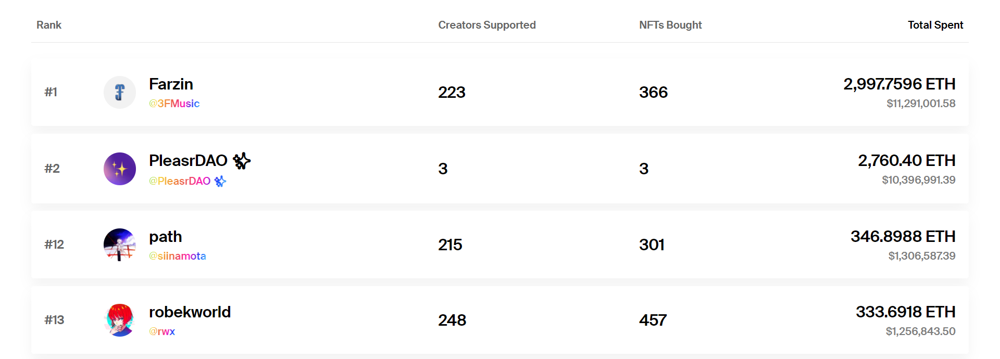
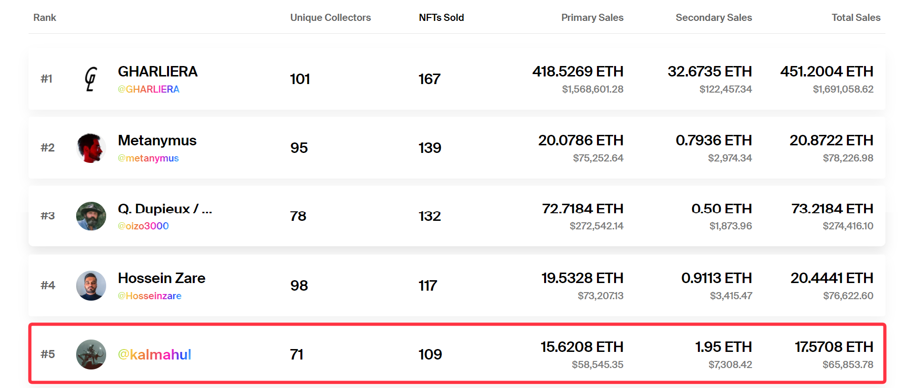
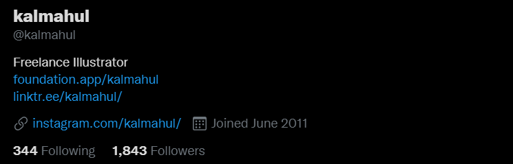
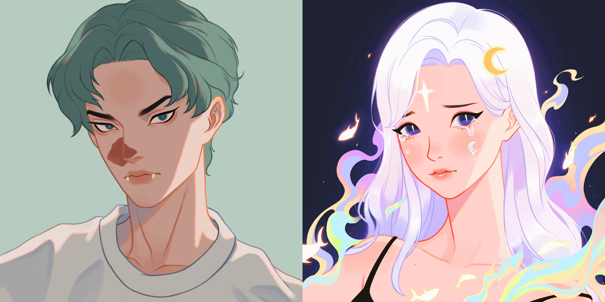
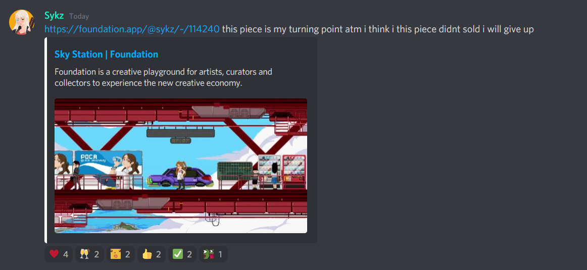
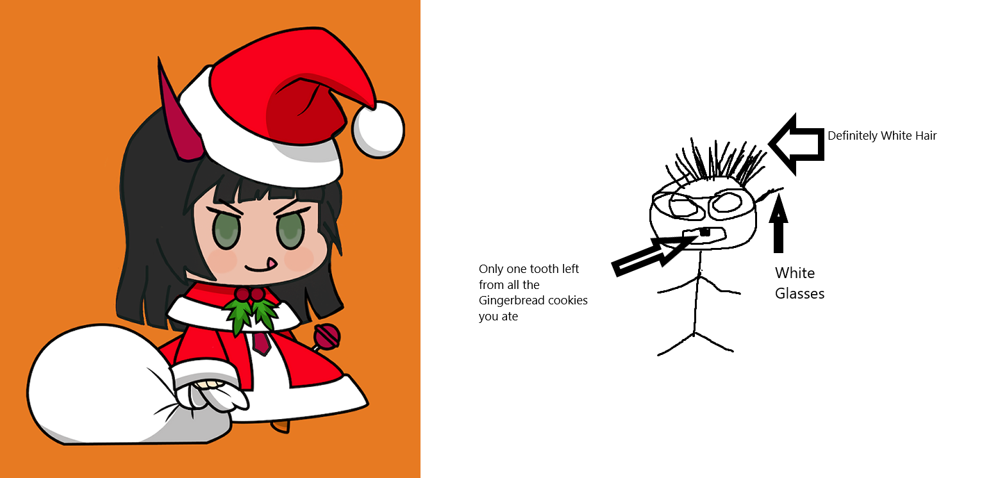

> 原文：[thoughts as an artist (january 2022)](https://mirror.xyz/shinjurou.eth/uIq__DaPcJ_Y3ku41N8_EGM7fZ8EIe1MwSYA3Q-ZMnA)

# アーティストとして思うこと（2022 年 1 月）

初めましての人ははじめまして、そうでない方はこんにちは。2021 年 9 月末頃に NFT 界に参加したアーティストの Shinjurou と申します。某赤毛の人をご存知の方なら、この記事のタイトルは、彼が以前書いたものをそのまま引用していることが分かると思います。彼の記事はぜひ読んでいただきたいのですが、今回は、あなた方が情報を探す練習になるので、ここに記事のリンクを貼ることはしません。

この記事は、現在のコミュニティの**アーティストに対する批判**があることを、心臓の弱い人に警告します。また、**皆さんの夢と希望を現実で打ち砕き、心の傷になるかもしれません**。この記事を最後まで読んでいただければ、現在の NFT 市場の仕組みがより明確に理解できるはずです。そうすれば、「**なぜ私の作品を買ってくれるコレクターがいないのか**」と自問する精神的負担を軽減することができます。これらの中には、誰もが市場の捉え方を変えなければ、数年以内に間違いなくエコシステム全体が死んでしまうような深刻な問題もあります。この記事は現在の市場の約 95％を占める小さなアーティストの皆さんに向けたものです。大物アーティストに関する話題には触れませんし、**大物コレクターについても（将来的にも）一切触れません。なぜなら、それらは私がコメントできない世界であり、それらについて語るには他の方が良い選択であると思うからです。**

この記事を書こうと思ったわけではなく、アーティストやコレクターと対話を続けるうちに、ふと思いついたのです。コレクターがこれを書くことは十分可能ですが、アーティストがコレクターに関して非常に偏った視点を持っているため、皆さんが完全に納得しないことは分かっています。私のような、皆さんと同じ小さなアーティストが言うことで、より親近感や信憑性を感じてもらえるのではないかと思っています。**正直に言って、私が書かないと誰も書かないでしょう**。

この記事の中では、何事も包み隠さず話すつもりです。なぜなら、私がこのテーマに触れなければ、皆さんは現在の大きな問題を理解することができないからです。現在、市場に存在する問題は「**毒のあるポジティブ**」です。この毒のあるポジティブのせいで、誰もが自分自身を疑い始め、絵を描くことに自信を失い、さらには NFT を完全に諦めて Patreon / Fanbox / Fantia へ帰ったのです。

> 免責事項：これは非常に意見的な記事であり、あなたはここで私の記事の一部または大部分に同意しないかもしれませんし、この記事では非常に厳しい現実の事実を含んでいます。私がここに書いたことに反対するのは全く問題ありません。私は、世界は平らだと信じている人に、世界は平らではなく丸いのだと積極的に説得しようとは思いません。ここに書かれていることに同意できないのであれば、この記事を閉じ、見返さないことも自由です。

## 毒のあるポジティブ

これは非常に重要な部分です、皆さんの夢と希望を現実で潰していきます。

> 「頑張ればみんなきっと成功する！」
> 「我慢して待てば、最初の入札が必ず入る！」

私は、このような毒のあるポジティブな励ましは、益となるよりも害となると思います。これは非常に非現実的です。自分の作品を買ってくれる人が誰なのか、現在の市場がどのように機能しているのかを理解していなければ、自分の作品が落札されることは期待できません。10 年間、漫然と絵を描き続けても、市場を理解していなければ、落札されることはないでしょう。

もしあなたが NFT に新しく参入した人で、SNS に多くのフォロワーがいない、あるいは現在のコミュニティに知り合いがいない場合、あなたの初出品の販売価格を高額（例：1ETH）に設定するとしたら、**この作品は 10000 年待っても絶対に買われないと、私は 100％の確信を持って断言することができます**。毒のあるポジティブな励ましはやめてください、誰の役にも立ちません。もし、あなたの作品が買われることを望むなら、もっと現実的になり、現在の市場を調査して、あなたの作品を買う受け手を発見する必要があるのです。

### 「コレクターとは、何もすることがなく、あまりにも暇なので、芸術家から美術品を集める金持ちのことである。」

この一文は**100％間違っている**と断言し、あなたの幻想を壊します。

これは大物コレクターには当てはまるかもしれませんが、一般的なアーティストを一貫してサポートしているコレクターの大半はクジラ（お金持ち）ではありません。彼ら全てに限界があるのです。

もしこの言葉に納得がいかないのであれば、Foundation の「Trending Collectors」を見てみてください。

[https://foundation.app/trending](https://foundation.app/trending)

クジラ vs 一般的なアーティストを支援してるコレクター

ここで、皆さんに理解していただくために、少し比較・計算をしてみます。

#### クジラコレクター

1 位の Farzin

    総支出額：2,997.75ETH
    購入したNFT：366
    購入したNFTの平均価格
    2,997.75 / 366 ≃ 8.19 ETH

2 位の PleasrDAO

    総支出額： 2,760.40 ETH
    購入したNFT：3
    購入したNFTの平均価格：
    2,760.40 / 3 ≃ 920.13 ETH

#### 一般的なアーティストを支援してるコレクター

12 位の path

    総支出額：346.89 ETH
    購入したNFT：301
    購入したNFTの平均価格：
    346.89 / 301 ≃ 1.15 ETH

13 位の robekworld

    総支出額：333.69 ETH
    購入したNFT：457
    購入したNFTの平均価格：
    333.69 / 457 ≃ 0.73 ETH

皆さんも、クジラと私たち小さなアーティストを応援してくれるコレクターの明確な違いが分かったと思います。

では、このロジックを皆さんに理解していただくために。

> 現在、アーティストが極端に多くいて、コレクターが極端に不足している。もし、みんながすべてのものに 1ETH 以上の価格をつけたら、彼らがあなたのアートワークを集めることはまったく不可能です。1000 人のアーティスト ×NFT あたり 1ETH ＝ 1000ETH ⇒ そしてアニメジャンルの最高額コレクターがいずれも<350ETH までしか到達しないので、需要と供給がアンバランスであることがはっきりわかります。
> また、二次元ジャンルで費やした ETH の総額では path が現在最高位のコレクターであり、path の「費やした総額」は Farzin よりかなり低い（346.8988ETH 対 2997.7596ETH）ことにも注意が必要です。
> これは極めて重要なことですが、robekworld と path の 1 個あたりの**平均購入額が 0.7 ～ 1ETH 程度であっても、その価格で売れるとは限りません。80%のアーティストは、もっと低い価格、時には 0.1ETH**でも出品しなければ、売れ行きが伸びない可能性が高いのです。

### なぜクジラはアートワークに 100ETH 以上を即座に投入するのに、1ETH 以上の小さなアーティストからは買わないのでしょうか？

1.  クジラは投資家です。もしそのクジラがピカソのファンでその画家がピカソなら利益は関係ない、そうでなければ、利益の出ない作品は買わないでしょう。
2.  小さなアーティストの作品を買っても、その作家が後に次のピカソにならなければ、**何の利益も生まれないから**です。だから、小さなアーティストに投資しても、クジラにとっては**大損に終わる**可能性が高い。
3.  クジラ市場には、大量の「フリッパー（転売ヤー）」が存在する。これらのクジラがアートワークのために 100ETH 以上を即座に投じることを躊躇しない理由は、彼らが将来この作品を**二次販売で再販売**させて利益を得ることができると十分に知っているからです。

クジラが目の前に現れたというあまりにも幸運なケースを除けば、最初から作品が高額に売れるということは 100％ありえません。

### 1ETH 以下のアートワークの中には、価格が同じか低いにもかかわらず、他の作品よりも早く買われるものがあるのはなぜですか？

NFT コストが高ければ高いほど、買い手は「**アーティストを支援する**」のではなく、「**投資**」としてアプローチする可能性が高くなります。高値で出品した場合は、「**自分は投資されるほどの価値があるのか？**」と自問自答してみてください。

NFT 市場における**作品の価値**は、アーティストではなく**コレクターが決める**のであることを、皆さんは理解する必要があるのです。

コレクターは皆、どんな作品を集めたいかという優先順位を持っている。即座にコレクションされる作品は、以下のような理由によるものです。

- その作品が、そのコレクターの**趣味嗜好（あるいは性癖）に 100％合致している。**
- その作品が、そのコレクターの**価値観に共鳴する深い意味**を持っている。
- その作品が、そのコレクターと**深い関わりを持つ人物によって制作された**ものである。
- 上記の理由以外では、その作品がコレクターの**予算に見合った価格**であったこと。

優先順位の高い作品を集めてから、他の作品にも目を向けてみよう、こういう理由で集めよう、と考えるのです。

- そのコレクターの**趣味には合っている**が、第一候補ほど優先順位が高くない作品。
- これらの作品は、コレクターの優先順位としては最上位ではないので、コレクターがこれらの作品を収集するのは、その作品がコレクターの予算に見合った価格であった場合に限られるということを知っておく必要があるでしょう。

もし、あなたの作品が何ヶ月も入札されずに放置されているのであれば、価格を下げるか、作品を複数エディションとして戦略を変えるように検討してください。Foundation で新しい一品物（1/1）のミントを計画もなく出品するのでは、結局ガス代だけを浪費してしまうことです。

### 他の人の作品には入札合戦があるのに、なぜ私の作品には誰も買わないのか？

優先順位リストについて上に書いたことを読み直してみてください。入札合戦は、この作品が特定のコレクターだけでなく、**複数のコレクターにとって同時に最優先**に当てはまる場合にのみ発生するのです。そのため、一人一人が必死になって、この作品を所有しなければならないと思い、FOMO（取り残される不安のこと）が激しくなるのです。

さいとうなおき先生の作品に連続に起こった激しい入札合戦について、私が気に入らないのは、「コレクターは皆お金持ちで、小さなアーティストが皆、市場や NFT の実際の仕組みを調べもせずに、高い販売価格ですぐに作品が購入されるようになる」という**幻想を与えてしまう**ことです。

**絵画のスキルだけでなく**、その**作品に含まれる意味**と**アーティスト自身の在り方**も含めて**価値を決める界隈である**こと、この重要な事実を皆さんは理解する必要があるのです。

**他人に影響を与えたり**、**誰かの人生に力を与えたり**するような価値がなく、純粋に自分の好みだけで作った作品が、瞬時に高値（例えば 1ETH 以上）で入札されるとは思えません。

この作品はさいとう先生の初 Foundation 作品であるにもかかわらず、なぜ他のアーティストと比較して大きな売り上げがあったのか、その理由を理解する必要があるのです。

[https://foundation.app/@NaokiSaito/foundation/98535](https://foundation.app/@NaokiSaito/foundation/98535)

### さいとうなおき先生の成功の重要な事実

1.  **ポケモントレーディングカードゲーム**や**初音ミクグッズ**のアートワーク、**ゲーム「ドラガリアロスト」のメインイラストレーター兼キャラクターデザイナー**として知られる、**日本を代表するアーティスト**です。
2.  さいとうなおき先生は、[ウィキペディアに専用のページ](https://en.wikipedia.org/wiki/Naoki_Saito)があるほど、重要な人物である。
3.  その**影響力は大きく**、彼が NFT に入り、その様子を Youtube で動画にした後、彼の**後を追って日本のアーティストが NFT に入るという大きな波**が起こりました。

あなた自身がこのレベルを達成できるのか、自問自答する必要があると思います。

> 2021 年 9 月からコミュニティで活動し、継続的に他の人を助けてきた（その結果、私は Anifriends Discord サーバーのモデレーターになり、この[アニメ NFT 情報データベース](https://docs.weeb3dao.com/en/)を書くために weeb3dao の一部になった）私でさえ、私の作品の入札争いを一度も経験したことがないのです。

さいとう先生のような大物アーティストは、**投資目的で購入する**コレクターもいるので、入札合戦が起こる可能性が高くなります。同時に、さいとう先生は**入札者全員に「スタンプ」の NFT プレゼントがある**ので、入札者の中には落札するつもりはなくても、彼の「スタンプ」は貴重なので**スタンプ目当てで入札する人もいる**かもしれません。

**夢や希望がそう呼ばれるのは、それが現実ではないから**です。あなたが人生で欲しいものを得ることができるようにするには、あなたの**期待と現実的である必要**があり、あなたの研究を行いましょう。

これは現実であって、何の理由もなく「その世界の人間はみんな自分より弱いから」という理由で異世界でヒーローになるような架空のアニメではありません。

### でも、Twitter の xxx さんは希少性と 1/1 が大事って言ってたぞ？

コレクターが Twitter でつぶやく他のどのつぶやきも、**希少性や 1/1 の重要性を大きく強調**しているように見えますが、ここではこれらのルールは適用されないことを知っておく必要があります。これらのルールは、大物アーティストやクジラコレクターにしか通用しないからです。1/1 の作品は、コレクターがその作品を集めることで、後日二次販売から転売して利益を得ようとする投資家である場合にのみ価値を発揮するのです。しかし現在、中小のアーティストを積極的に支援しているコレクターは、クジラでも転売ヤーでもありません。**投資として作品を買う人がいないのであれば、希少性はあまり重要ではありません**。

大きな金額を稼ぐために何ヶ月も、あるいは何年も待つよりも、**高い頻度で少なく稼ぐ方が良い**のです。待つことで徐々に自分の画力、価値観に疑問を持ち、精神的な健康が損なわれていくからです。

誰かがあなたの作品に最初の入札をするまでに何年も待つことを精神的に覚悟した上で Foundation や主要なマーケットプレイスで 1/1 のみミントすることです。

もし、待つことで精神的に疲弊したくないのであれば、常に低めの販売価格で作品を出すか、複数エディションとして作品を出品することを検討してみてください。

**高い販売価格で出品していいのは自分の最高傑作だけ。そして待ってる時間に耐えられるよう、精神的な準備をする。**

## 安い > 高い

高いより安いほうがいい理由：

1.  なぜなら、Foundation の一品物（1/1）を集めるコレクターを待つよりも、あなたが期待している金額を簡単に獲得できる可能性が高いからです。Foundation で作品の最低入札価格を 0.5ETH に設定した場合、低予算の他の人があなたの作品を収集する可能性をすべて排除していることになるのです。最低入札価格を 0.025ETH で 20 発行数に設定しても、その 0.5ETH の価格から得られるのと同じ金額を得ることができます。**0.025 ETH x 20 発行数 = 0.5 ETH**です。
2.  また、より**多くのコレクター**があなたの作品を安価で収集することは、あなたの**自信を高めます**。これは、多くの人があなたの作品を実際に愛しているということを、さりげなく伝えてくれるからです。また、このようなコレクターは、Twitter や Cyber ギャラリーでもあなたの作品を紹介してくれますよ。
3.  また、低価格のエディションは、コレクターだけでなく、他のアーティストもあなたの作品を収集するのに役立ちます。つまり、**コレクターになる可能性のある人の幅が非常に広がる**のです。
4.  「ガス代」を節約する。高い最低入札価格を設定したアーティストが、売れなかったために価格を下げ続けなければならないのを見たことがありますが、Foundation でこれをやると、ガス代がかかります。ダッチ・オークション機能のあるプラットフォームを使えば、この問題は解決します。
5.  **市場の価格発見を促す**。低価格でスタートすることで、人々はより高い価値があると思えば入札し、小さな入札合戦になる可能性が高まります。
6.  多くの人が入札することで、たとえ入札額が低くても、作品をより**魅力的に見せる**ことができます。

Foundation で**低価格の 1/1 をミントしてもいいです**。ガス代が高く、15%の手数料がかかりますが、メリットもあります。

1.  現在、Foundation は二次元イラストコレクターの最大のネットワークを持っています。Foundation を利用することで、**より簡単にあなたを発見する**ことができます。
2.  ニュースフィード。コレクターが何かに入札すると、そのコレクターをフォローしている全員のフィードに表示されます。通常、コレクターは Foundation のアーティストよりもずっと多くのフォロワーを持っています。
3.  トップページ。価格が低くても複数の入札を受ける（小さな入札合戦）ことで、Foundation のトップページの「Trending auctions」に掲載される確率が高まります。

コレクターが増えれば増えるほど、**リツイートや宣伝のチャンス**も増えます。また、コレクターの基盤を構築しておけば、手数料が安いなどの理由で別のプラットフォームで販売しても、一部のコレクターから継続的なサポートを受けられる可能性が高くなります。

また、質より量を重視すべきではありません。コレクターを惹きつけるには、**作品の品質と一貫性が重要**なのです。ひたすら落書きをするよりも、自分のスキルを向上させる方が、長い目で見れば良い結果になるはずです。

> 今現在、作品をエディションとして掲載するには、Manifold を使用してミントし、OpenSea に作品を掲載するのがベストな選択でしょう。私はまだ Manifold を使ったことがないので、これに関する情報はありません。また、独自スマートコントラクトでミントする方法がわからない、あるいは余裕がない場合は、OpenSea を使用してミントすることも可能です。

余裕ができて、**挑戦ができそう**だと思ったら、**NFT のトップクリエイター**になるための**計画を立て、高値相場を目指す**ようになるのです。そうでなければ、**大多数のアーティストが低価格で出品する**はずです。

## 実例紹介

一品物 1/1 という現在の市場で、すべての作品を**非常に手頃な価格**で、**高いクオリティで提供**し、**それで満足している**2 人のアーティストを例に挙げます。

### kalmahul

[https://foundation.app/@kalmahul](https://foundation.app/@kalmahul)

kalmahul の Foundation ランキング（2022 年 1 月 2 日）。

kalmahul は、そのクオリティの高さにもかかわらず、最低入札価格を本当に低く設定しているアーティストです。kalmahul は**109 点**（2022 年 1 月 2 日時点）の作品を Foundation に掲載しており、**71 人というとてつもなく多くのコレクターがいる**ことがわかります。

kalmahul の総売上高は GHARLIERA よりかなり低い（17.5708ETH 対 451.2004ETH）ですが、kalmahul は完全に満足しており、最低販売価格を上げる必要性を感じません。これは、滅多に無い一度だけ起こる大きな売上よりも、**小さな連続した売上**の方が、より**大きな金額になるように蓄積される**という事実があるためです。また、kalmahul の Twitter アカウントには、そんなにフォロワーがいないことにも注意が必要です。

kalmahul の Twitter アカウントには、1843 人のフォロワーがいます（2022 年 1 月 2 日）。

### Your.Yeh

YourYeh は、NFT 界隈で私がとても好きなアーティストの一人です。

[https://opensea.io/collection/veras](https://opensea.io/collection/veras)

彼女の VERA'S コレクションは、すべての作品が**非常に手頃な価格（0.02ETH から 0.04ETH まで）**に設定されています。そして、その一貫性とスキル進歩のおかげで、彼女の**新しい作品の一つ一つは、すべてすぐに完売**しています。これは、YourYeh のすべての作品があまりにも素晴らしく美しいし、他の誰もが逃したくないからです（私自身もその一人です）。

[Vera’s Julio #1](https://opensea.io/assets/0x495f947276749ce646f68ac8c248420045cb7b5e/39468212016962231687323574411603428682752898860860677474724174927366134431745) は YourYeh のこのコレクション最初の作品です。タイムスタンプを見てみると、YourYeh が最初の Vera's をミントしたのは 2021 年 10 月 3 日ですが、Julio #1 は 2021 年 10 月 21 日に販売されたものであることがわかります。私は YourYeh が Vera's コレクションを完売状態にする前から YourYeh のフォロワーの一人でした。Vera's は 1 日で成功したわけではありません。これは、YourYeh の一貫性と努力のたまものです。コレクターにとって一貫性は重要ですが、個人的には、アーティストとしてのスキルアップも重要であると思います。

Vera's Julio #1（左）、 Vera's moonlight #114（右）

この 2 人の Vera を並べると、画力の向上がよくわかる。YourYeh の作品は、Vera's コレクションを作り始めてからわずか 3 ヶ月の間に、「いい感じ」から「まじかよやべぇ」（そう、Vera の moonlight #114 を見てそう感じたのだ）へと変化したのである。YourYeh の Twitter には、「毎日タイ時間夜 8 時に新作を出品」と、とても明確なドロップスケジュールと、描く目的に対する明確なビジョンが掲載されています（この[Vera'sの説明文](https://opensea.io/assets/0x495f947276749ce646f68ac8c248420045cb7b5e/39468212016962231687323574411603428682752898860860677474724175038416808837121)に記載されています）。

現在、私の Twitter や Foundation をフォローしている方はわかると思いますが、最近 Foundation で他のアーティストの作品を入札するようになったんです。なぜ私がこれらの作品に入札するかというと、主に「優先順位リスト」にあるからです。優先順位の上位に入る作品がない限り、**YourYehはこれから先も継続的に支援するアーティストである**ことは間違いありません。なぜなら、YourYehは個人的に縁のあるアーティストであり、今のところ彼女の作品に一度に大きな金額をかけることはできないが、後日必ずリピートするつもりだからである。

また、YourYeh さんのケースから、作品をより**手頃な価格に設定する**ことで、**多くのコレクターを獲得する**ことができるというメリットも、皆さんには理解できたのではないでしょうか。多くのコレクターがいることは、**大きな自信につながり**、今後の**作品制作のモチベーション**にもつながります。

そのため、コレクターの予算からかけ離れた価格を設定し、その結果自分のスキルや価値を疑うよりも、手の届く価格で価格を設定する方が実は効果的なのです。あなたの作品が他のアーティストより低価格で買われたからと言って、あなたの作品が劣っているとは限りません。このような理由で、**他人と自分を比較するようなことはしないでください**。これは、あなたの**自信とメンタリティーを破壊すること**になります。

コレクターがその金額でしか落札できないのは、**そのコレクターが今できる最大限の支援である**可能性が高いからです。以前、「**コレクターには予算と限界がある**」という話をしたのを覚えているでしょうか。もし、あなたがより手頃な価格で作品を出品すれば、**完売の可能性は飛躍的に高まります。**

## 物乞いをしない

これは、現役のアーティストにとって重要な注意点です。もし、あなたの友人が数ヶ月経っても入札がなく、自信をなくしているようなら、誰かに友人の作品を買ってもらうよう懇願するのではなく、**コミュニティに参加するよう**促し始めてください。この界隈では、誰もが努力する必要がある場所です。あなたが懇願してその作品が入札されるのは非常に不公平です。他の何千人もの人々がコミュニティで活動し、積極的に他の人々を助けていて、最初の入札を待っているのです。

> 「誰もが成功する！」という毒のあるポジティブを止める必要があります。誰もが成功するわけではありません。誰もが欲しいものを手に入れられるわけではありません。**成功するのは、実際に努力をした人だけ**です。そして、普通の人をはるかに超えた努力をした人だけが、天井を突き抜けることができるのです。なにもしない者は、取り残される。

厳しいですが、この世界で成功したいのであれば、この事実を受け入れなければならないのです。そして、描きの仕事の大半は（特に開発途上国では）NFT の世界で得られる収入の半分にもならないのですから、このようなチャンスがあることを感謝すべきだと思います。

ここは可能性に満ちた場所ですが、努力を拒む人には居場所がありません。さっさと諦めて、**依頼絵を描いたり、fanbox・Fantia・skeb・Patreon へ戻ったほう**が、実は得策なのだ。

NFT でコミュニティが重視されるのは、**一番応援してくれそうなのが、知らない人ではなく、自分の知っている人**だからでしょう。この記事を読んで、コレクターが何かをやるのを待つのではなく、アーティスト自身がもっと積極的に助け合うようになるのではないかと思います。

## ジョーク

私たちの大半は冗談好きで、いつもミームで盛り上がっているので、ある種の無神経なジョークを、これが誰かを傷つけることになると考えずに言い始める人がいることも承知しています。

誰もが注意すべきジョークのレベルは明確です。親しい友人を「ゴミ」と呼ぶ習慣があるからといって、見知らぬ人がその言葉を安易に受け取るとは限りません。ジョークは親しい友人とだけ話す閉じた環境でのみ行使し、Discord の公開チャットのような公共の場では行わないようにしましょう。一度や二度しか話したことのない相手に対してこのような言葉を発することは、有害な人間として見られるだけで、避けるべきでしょう。

冗談と本気を区別することは、私たちの大多数には全く不可能です。目の前のモニターだけで、相手の表情やしぐさは見えないので、長い間、相手と話し続けて初めて区別がつくのです。

**言葉は人を殺す刃になりうる**。ネットいじめや殺害予告のジョークは、多くのアーティストがこの界隈に参加し、実際に罵倒メッセージを受け取っているので、非常に無神経なものです。

**ネットいじめや殺害予告は、実際に死亡につながる**。その代表的な例が木村花さんです。彼女はネットいじめを受け続けた後、最終的に自殺で亡くなっています。

[https://www.theguardian.com/world/2021/mar/31/hana-kimura-death-man-charged-over-cyberbullying-of-japanese-reality-tv-star](https://www.theguardian.com/world/2021/mar/31/hana-kimura-death-man-charged-over-cyberbullying-of-japanese-reality-tv-star)

現実のいじめとネット上のいじめは全く違う。言葉は、実際の物理的な傷害と同じくらい人を傷つけることがあります。ネットで他人に罵詈雑言を浴びせる前に、自分の言葉の重さを理解する必要がある。

（🐷：ここは英語圏向けですしスキップしてもいいと思います）

個人的には、日本人の考え方に近いコミュニケーションを、みんなが実践してみてもいいのではないかと思っています。日本語には英語にある汚い言葉はなく、英語の汚い言葉と訳される「Kuso」でさえ、実際には「Damn it」の意味しかない。

日本語には「丁寧語」と「くだけた言葉」があります。街で誰かに会ったら、24 時間いつでも丁寧語を使うでしょう。アニメや漫画では、登場人物がエッジの効いた言葉遣いをしていたり、汚い言葉を使っていたりしますが、実際の日本に住んでみると、そういった言葉は基本的に存在しないことがわかると思います。私自身、日本にいるとき「クッソ」なんて言われたことはありません。

このように、ある一定の距離を保つことで、初対面の人をうっかり怒らせてしまって、相手の気持ちを傷つけてしまい、また木村花さんのようなケースが起きてしまうということを防ぐことができるのではないでしょうか。

（🐷：ここまで）

誰かに向けて冗談のように乱暴な言葉を使い始める前に、よく考えてみてください。もしあなたが「私の作品を買ってくれないなら、殺害予告を送る」と言うのなら、あなたはコレクターだけでなく、仲間のアーティストも怖がらせていることになります。

多くの皆さんはこのようなことを考えたことがないと思いますが、せっかく書き出したのですから、今後はこのような具体的な罵倒を改めることを学んでほしいと思います。他の人に親切にすることを忘れないでください。あなたの言葉が、誰かの気持ちを傷つけるかどうかはわかりません。言葉は刃物にもなり、人を殺すこともあるのです。

## 支え合う

このガイドを読み、現在のコレクターを理解した今、皆さんもコレクターが救世主になるのを待つのではなく、**積極的に助け合うようになればいい**と思います。コレクターには限界があることを常に忘れないでください。彼らが実際に支援できるアーティストの数は限られているのです。そして、あなたは今、すでに「優先順位リスト」を理解していますね。

今のコミュニティの中で、皆さんが今、本当に応援すべきアーティストが一人、 [Sykz](https://twitter.com/ChinpongR)です。

[https://foundation.app/@sykz/mypixel/1](https://foundation.app/@sykz/mypixel/1)

Sykz さんは、Anifriends で他のアーティストやコレクターのオリジナルキャラクターや PFP のファンアートや二次創作を数多く手がけているメンバーです。それなのに、彼の作品を集めたことがあるのは、主にただのコレクターばかりで、アーティストがほとんどいないのです。現在、私が彼の作品を所有しているのは、RPGPIXEL のコレクション OpenSea の NFT のみであり（彼からのプレゼントではなく、買いました）、Foundation の他の作品は所有していません。理由は、これらの作品が私の「優先順位リスト」に該当せず、ほとんどが私の予算から大きく外れているためです。Sykz さんの作品の中で、個人的に本当に集めたいのですが、予算オーバーで買えない作品が 1 つだけあります。（Sykz さんがこれを読んだ後、この作品の価格を下げてくれることを密かに願っています）

これは、Sykz さんが最近 Anifriends の Discord に送ったメッセージです（Sykz さんは、数ヶ月前にすでに NFT をやめようと思っていて、何度も失敗していたけれど、この作品をミントしたらすぐに「Sky Station」が入札が入ったおかげで、今も一緒にここにいるんだ、と安堵しました）。

Anifriends Discord のチャットで Sykz のメッセージ。

皆さんは、このような事態を考えておく必要があります。

> 「もし誰も Sykz さんの作品に入札しなかったら？」

もし、コレクターが Sykz のこの作品に入札しなかったら、彼はただ辞め、完全にコミュニティを去ることになったでしょう。彼に与える「ありがとう」や「賞賛」は、**Sykzの生活を支えるものではない**からです。もし、彼にこのコミュニティーに留まり続けてほしい、もっと作品を作ってほしいと願うのであれば、あなた方は可能な限り、彼を積極的にサポートする必要があります。

[彼の RPGPIXEL は 0.03ETH と非常に手頃な価格です。 ](https://opensea.io/collection/rpgpixel-1)

少額でも積み重なれば大きな金額になりますので、覚えておいてください。

> また、ここでみんなに積極的に応援されて、2022 年に Anifriends のゲームを作る可能性が高くなる。みんなは彼に同調圧力をかければいいのだから。（これを見た Sykz に追いかけられる前に、今すぐ隠れるよ）

**コレクターを待つのではなく、今のアーティストが積極的に行動し、支援し合うことが大切です**。NFT のグループチャットに参加すれば、同じ経験をしたアーティストと話をすることができるので、アーティストが他のアーティストをサポートするのは実は簡単なことなのです。いわゆる「波及効果」というものがあります。もし、今、あなたが誰かを助けたら、その人の知り合いで、以前あなたより高い売り上げを上げた人が、将来あなたを助けるかもしれないし、他の可能な方法もあるのです。皆さんが常に助け合うことで、長い目で見ればコレクターの負担を軽減することにもつながります。

## エコシステムの維持

> この部分は、今後できるだけ長くコミュニティを存続させるために、とても重要なポイントになると思います。

今はまだ NFT の市場は黎明期で、**作り手よりも消費者の方が少ない状況**です。この分野では多くの人が、NFT を世の中に普及するために、果てしない努力を続けています。デジタル・ルネサンス時代を築くために、エコシステムを維持する必要があるのです。

小さなアーティストを積極的に支援するコレクターがクジラでないことは誰もが知っていることですが、こうしたコレクターもいつかはいなくなることも知っておく必要があります。現実が厳しいだけに。**「すべての物事にはいつか終わりが来る」**のです。今の生活を支えてもらっているコレクターが、これから 50 年先もここにいることは非現実的です。現在のエコシステムを維持するためには、これらの**コレクターと同じビジョンを持つ新しいコレクターがこの界隈に参加する**か、現在のコレクターがいなくなった時、**現在のアーティストが未来のコレクターになるしかない**のです。それが、エコシステムを継続するための唯一の解決策なのです。

ここにいる皆さんは、**今はまだ小さなアーティスト**かもしれませんが、いつか**コレクターになる可能性は十分にあります**。今のコレクターがあなたを支えているのと同じように、他の人を支えてあげてください。このサイクルが終わってしまうと、今後、小さなアーティストが生活していけるだけの賃金が見込めなくなります。NFT が小さなアーティストを助けることができる可能性を感じてこの場に参加した皆さんは、この情報を今後も持ち続け、可能な限り積極的に貢献することが重要だと思います。

## コレクターへのメッセージ

> 絵を描いてみたいと思っているコレクターの皆さん、ぜひどうぞ。お絵かきはとても楽しいです。

私は「**誰でも絵を描くことができる**」と信じています。

「誰もが絵を描ける」と「誰もが上手に描ける」は全く違うということを、皆さんは知っているでしょう。芸術のスキルは、継続的な練習の後にのみ発展することができ、膨大な量の忍耐と献身を必要とします。「誰でも描ける」というのは、「やってみれば描ける」という意味であり、「最終的な絵になる形を作るために、どのように筆を揃えたらいいか」ということです。あなたはすぐに上手になる必要はありませんが、練習すれば練習するほど上手くなります。

特に、数年前に見つけたこの動画がとても気に入っています。

[https://www.youtube.com/watch?v=7TXEZ4tP06c](https://www.youtube.com/watch?v=7TXEZ4tP06c)

そして、最近 Twitter でつぶやいたことも、この見解に沿うものです。

[https://twitter.com/shinjuroukai/status/1476637318354137088](https://twitter.com/shinjuroukai/status/1476637318354137088)

> 多くの人は、自分の居心地の良い場所から一歩踏み出すことを恐れているように感じますが、正直なところ、そこから一歩踏み出すことが、生きていると実感できる唯一の方法なのだと思います。

描いた人：Ligaratus（左）、Aziz（右）

**この 2 つのケースは、コレクターが絵に挑戦する具体的な例として、私がとても気に入っているものです。**

[Ligaratus](https://twitter.com/ligaratus_)は最近、デジタル絵について質問してきたのですが、[Aziz](https://twitter.com/_JustAziz_) は Anifriends のシークレットサンタ 2021 イベントのプレゼント作品として作ってくれました。

こういうコレクターが絵を描くことに興味を持ってくれるのは、本当に嬉しいことですね。この絵の NFT は、すでに私の Ledger ハードウェアウォレットに移しました。私の白髪のキャラクターへのこだわりとミームへの愛情を見事に捉えていて、とても気に入りました。

今の NFT 界隈は、みんなが積極的に励まし合って作品を向上させることができるのがとてもいいところです。誰もが最初は初心者ですが、コツコツと練習すれば技術は身につきます。ペンを握ったこともない人が絵を描き始めて、数年後に上手になることも十分あり得ます。

その代表格が[フィンセント・ファン・ゴッホ](https://www.vincentvangogh.org/) で、1881 年、28 歳のときに最初の絵を描いている。

## 最後に

ここで、延々と書き続けるのは終わりにします。この情報が、現役のアーティストの皆さんが、より現実的な期待を持って、精神的に健康な空間で過ごすための一助となれば幸いです。

また、今後、何らかの重大な問題が発生しない限り、私が皆さんにガイド・記事の類を書くのは、ほぼこれが最後となるでしょう（ご勘弁を）。（🐷：2 本目あるらしいねぇ……？）

[このガイド](https://docs.weeb3dao.com/en/)とこの記事を書くために、私は多くの時間と労力を費やしましたが、それは新しい作品を作るために使うことができたはずです。

私がこの領域に入ったとき、誰からもガイドラインは全くありませんでした。今[weeb3dao データベース](https://docs.weeb3dao.com/en/)が利用できるのは、私の一貫した研究と、この領域の皆さんとの絶え間ないコミュニケーションによるものだけです。KnownOrigin、SuperRare、Kalamint は私が参加できていないマーケットプレイスです（KnownOrigin から拒否のメールを受け取りました。[Grey](https://twitter.com/GreyRadian)と[Felix](https://twitter.com/Felix_Thirasat)が知っている情報を教えてくれて、ありがとうございました。） 将来的には、データベースには、アーティストが自分の知識を共有するための「貢献者」が追加される可能性が高いです。

冒頭で Robek の記事のリンクを貼らないと言ったのは、皆さんには今から自分で調べる努力をしてほしいからです。今のマーケットで何をすればいいのか、どう動くのか、皆さんはもう基礎が出来ていると思います。私のような一介の人間が、何をすべきかなどの細かいガイドや詳細をいちいち書くのは、他にやりたいことが山ほどあるのに、現実的に不可能です。

[weeb3dao データベース](https://docs.weeb3dao.com/en/)を作成したとき、私は金銭的な報酬を一切受け取っていませんし、このデータベースに参加しているすべての貢献者も同様です。私は、これらの人々がこれまであなたをサポートするために犠牲にしてきた努力と時間の量を評価してほしいと思います。

2022 年は Discord も Twitter もあまり活発な活動は見られないと思います（すでにお気づきの方もいらっしゃると思いますが、Anifriends は昨年 12 月にメンションがない限り、もう活動していません）。9 月にスペースに入ったおかげで、数年前に失った絵を描くことへの情熱をようやく取り戻したので、2022 年は主に新しい作品の制作とスキルアップに専念する予定です。

皆さんも今すぐ巣立ち、一人旅に出られるといいですね～（ただし、親代わりという名詞で呼ぶなら、私は女の子というよりおてんば娘なので、女性代名詞はあまり連想できないので、ママよりパパの方がいいと思います）。

2022 年、皆様にとって良い年でありますように。🎉

---

rwx.eth、Shiomu.eth、ligaratus.eth、Morello.eth には、フィードバックをいただき、私の残念な Engrish（これはタイプミスではありません）を救うためにこの記事を校正していただき、大変感謝しています。そして、これを読む以外には何もしなかったが、私の先輩であるという理由だけでここに名前が挙がっている saltseacake.eth に名誉の言葉を捧げます。

また、rwx.eth、Shiomu.eth、ligaratus.eth、Morello.eth、KaijuKing779.eth、abdulaziz.eth には、これまでの助けに感謝したいです。この記事は、あなたたちなしでは成り立たなかったでしょう。

記事のバナー絵を提供してくれた Robek に感謝します（私が希望と夢の町を焼き尽くす様子を描いてくれてありがとう）。そして私の主なインスピレーションになってくれています。この記事の収益の 50％は Robek に寄付されます。
